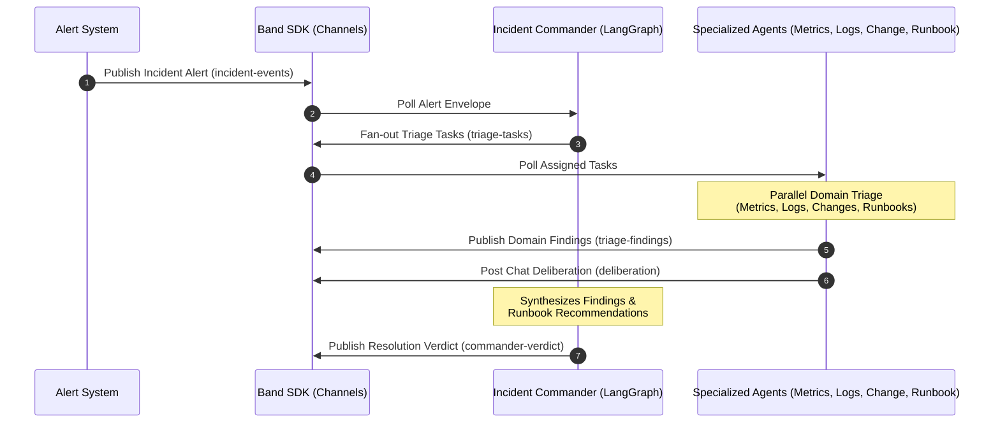

# 🚨 The War Room: AI-Driven Incident Response Platform

> **Hackathon Project Showcase**
> *Automating cloud infrastructure triage and resolution coordination using cooperative AI Agent Swarms.*

---

## 📖 Project Overview

When cloud services experience outages or latency spikes, every second counts. Traditional incident response requires on-call engineers to manually check logs, query metrics dashboards, audit recent code deployments, and match current issues against complex runbooks.

**The War Room** is a multi-agent Incident Response platform that automates this workflow. It coordinates specialized AI agents using the **Band SDK** protocol, simulating a synchronized "War Room" where agents exchange findings, deliberate on causes, and coordinate a mitigation plan in real-time.



---

## 🛠️ Tech Stack & Agent Frameworks

To demonstrate real-world extensibility, **The War Room** integrates a diverse set of modern LLM agent frameworks, showcasing how they can be unified via a single communication bus (the **Band SDK**):

| Agent Name | Role | Framework / SDK | Primary Logic |
| :--- | :--- | :--- | :--- |
| **Incident Commander** | Orchestrator & Synthesizer | `LangGraph` | Coordinates task fanning, reviews agent observations, and issues final verdict. |
| **Metrics Agent** | Telemetry Analyst | `CrewAI` | Analyzes CPU, memory, and database metrics for anomalies. |
| **Logs Agent** | Code & Exception Audit | `Anthropic SDK` | Traces execution threads and logs for crash dumps or 5xx exceptions. |
| **Change Agent** | Configuration & CI/CD Audit | `Pydantic AI` | Detects recent production deploys, schema updates, or flag changes. |
| **Runbook Agent** | Playbook Matcher | `Claude SDK` | Checks historical runbooks to recommend immediate mitigation actions. |

---

## 📁 Repository Directory Structure

```bash
├── agents/             # Dedicated codebases for each AI agent
│   ├── commander/      # Orchestrates alerts and tasks (LangGraph)
│   ├── metrics_agent/  # Observability and metrics parsing (CrewAI)
│   ├── logs_agent/     # Application log scanner (Anthropic SDK)
│   ├── change_agent/   # CI/CD and deploy correlation (Pydantic AI)
│   └── runbook_agent/  # Playbook lookup and mitigation (Claude SDK)
├── band/               # Agent specifications and communication channels
│   ├── agents.yaml     # Agent metadata registry
│   └── channels.yaml   # Event-driven message channel mappings
├── data/               # Mock data sources (incidents, runbooks, logs)
│   └── inc-001/        # Incident simulation config containing alert JSON
├── demo/               # Walkthrough materials and execution scripts
│   ├── demo-script.md  # Detailed step-by-step description of the flow
│   └── run_demo.py     # Runnable console-based simulation script
├── lib/                # Shared utilities, Pydantic models, and client mocks
│   ├── band_client.py  # Mock wrapper mimicking Band SDK communication bus
│   ├── models.py       # Pydantic schemas (Finding, TriageTask, Verdict)
│   └── evidence.py     # Incident evidence generators
└── tests/              # Comprehensive test suites verifying agent interactions
```

---

## 🚀 Getting Started & Execution

### 1. Prerequisites
Ensure you have Python 3.10+ installed. Install the baseline dependencies:
```bash
pip install pydantic
```

### 2. Running the Interactive Simulation
You can trigger the entire incident response sequence in your console. This runs the commander, feeds mock telemetry to the agents, starts the deliberation chat, and prints a formatted timeline:
```bash
python demo/run_demo.py
```

### 3. Running the Test Suite
Validate the reliability of the agent orchestration schema using pytest:
```bash
python -m pytest
```

---

## 🎯 Implementation Roadmap

- [x] **Phase 0:** Scaffold directory structure and define Pydantic schema validation.
- [x] **Phase 1:** Core agent registration spec (`agents.yaml`) and communications setup (`channels.yaml`).
- [x] **Phase 2:** CLI Interactive Simulation (`demo/run_demo.py`) and step-by-step documentation.
- [ ] **Phase 3:** Integrate live API credentials for LangGraph, Anthropic, and OpenAI.
- [ ] **Phase 4:** Build the Web UI Dashboard using React & TailwindCSS.
- [ ] **Phase 5:** Implement real-world alert ingestion from Datadog and PagerDuty webhooks.
